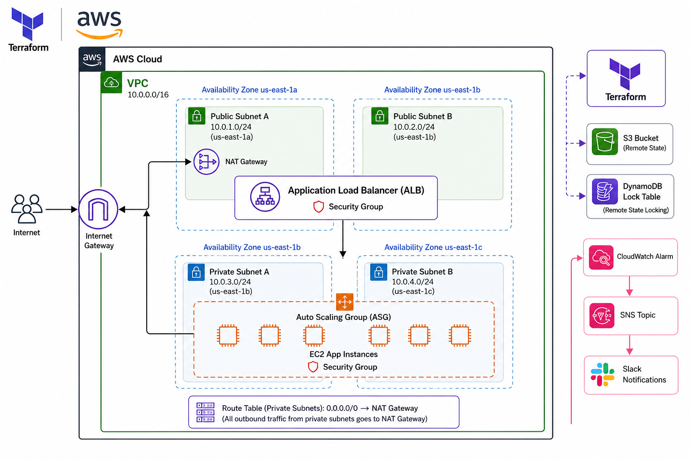

# Terraform AWS Lab

This project builds a multi-AZ AWS network and application stack with Terraform.

## Architecture



## What It Creates

- a VPC
- one public subnet
- a second public subnet for the load balancer
- two private subnets for the application layer
- an Internet Gateway
- a NAT Gateway for private subnet outbound access
- route tables and associations
- an Application Load Balancer
- a target group and listener
- an Auto Scaling Group for private app instances
- an S3 bucket
- an IAM role and instance profile so EC2 can access S3
- CloudWatch CPU alarm with SNS alert delivery
- a security group for web instances

## Project Layout

- `provider.tf`: AWS provider and Terraform provider version
- `backend.tf`: remote state configuration
- `variables.tf`: input values for the infrastructure
- `vpc.tf`: VPC, subnets, routing, IGW, NAT
- `alb.tf`: application load balancer and target group
- `autoscaling.tf`: launch template and Auto Scaling Group
- `security_groups.tf`: security group rules
- `s3.tf`: S3 bucket and IAM access for EC2
- `monitoring.tf`: CloudWatch alarm and SNS alerts
- `outputs.tf`: useful IDs after apply
- `bootstrap/`: one-time setup for S3 backend and DynamoDB locking

## Remote State Bootstrap

Terraform remote state needs the S3 bucket and DynamoDB table to exist before the main project can use them.

Run the bootstrap project first:

```bash
cd bootstrap
terraform init
terraform apply
```

After the bucket and lock table exist, return to the main folder and migrate state:

```bash
terraform init -migrate-state
```

## Main Workflow

```bash
terraform plan
terraform apply
terraform destroy
```

## Best Practices

- Keep Terraform code in Git, but keep secrets out of Git.
- Store real secret values in local `terraform.tfvars`, environment variables, or a secret manager.
- Mark sensitive variables as `sensitive = true` in Terraform.
- Use S3 + DynamoDB for remote state when working in teams or when you want durable state.
- Use CloudWatch alarms for monitoring and route alerts through SNS.
- Use a Slack bridge or webhook only for notifications, not for storing secrets.
- Prefer private subnets for app servers and keep only the load balancer public.
- Use Auto Scaling Groups instead of standalone EC2 instances for app workloads.

## Notes

- The public subnet is used for internet-facing resources and the NAT gateway.
- The load balancer uses both public subnets for high availability.
- The private subnets use the NAT gateway for outbound internet access.
- EC2 permissions to S3 come from IAM roles, not from the VPC itself.
